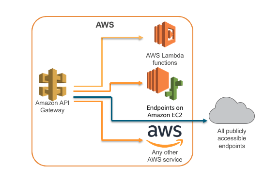

title: api gateway vs alb
theme: sudodoki/reveal-cleaver-theme
author:
    name: Leonardo Santos
    twitter: rmnobarra
    email: rmnobarra@gmail.com
output: apigw-vs-alb.html

--

# api gateway vs alb

--

## alb

--

camada 7

--

Integra (backend):
* ec2
* ecs
* endereços IP
* lambda

--

Características

--

* path conditions (/streaming, /api, /videos)
* host conditions (example.com, teste.example.com)
* http header conditions ("Values": ["CUSTOM-METHOD"],"Values": ["*Chrome*", "*Safari*"])

--

--

preço: 

--

lcu (Unidades de capacidade de balanceador de carga)

--

* 0,0225 USD por Application Load Balancer-hora (ou hora parcial)
* 0,008 USD por LCU-hora (ou hora parcial)

--
## api gateway

--

Suporte:

--

* rest
* http
* websocket

--

Rotas baseadas em verbos (GET,POST, etc)

--

path /api, /streaming, etc

--

Características

--

* gerenciamento de tráfego
* suporte de CORS
* controle de autorização e acesso
* monitoramento
* gerenciamento de versões de API.
* Import de apis (padrão openapi /swagger)
* rate limit
* Suporte a N tipos de autenticação e autorização

--

--

Preço: 

--

apis http:

Número de solicitações (por mês)	Preço (por milhão)

Primeiros 300 milhões	1,00 USD

Mais de 300 milhões	0,90 USD

--

apis rest:

Número de solicitações (por mês)	Preço (por milhão)

Primeiros 333 milhões	3,50 USD

Próximos 667 milhões	2,80 USD

Próximos 19 bilhões	2,38 USD

Mais de 20 bilhões	1,51 USD

--

apis websocket:

Número de solicitações (por mês)	Preço (por milhão)

Primeiro 1 bilhão	1,24 USD

Mais de 1 bilhão	1,04 USD

--

Links:

--

preço alb: https://aws.amazon.com/pt/elasticloadbalancing/pricing/
preço api gateway: https://aws.amazon.com/pt/api-gateway/pricing/

--

